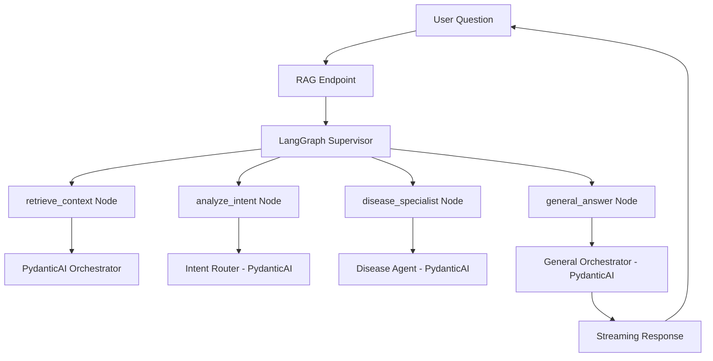

# LangSmith Integration Guide for AI Curation Multi-Agent System

**Version**: 1.0.0
**Date**: 2025-01-17
**Status**: Implementation Ready
**Author**: AI Curation Engineering Team

---

## Table of Contents

1. [Executive Summary](#1-executive-summary)
2. [Architecture Overview](#2-architecture-overview)
3. [Integration Strategy](#3-integration-strategy)
4. [Implementation Plan](#4-implementation-plan)
5. [Code Changes](#5-code-changes)
6. [Testing & Validation](#6-testing--validation)
7. [Production Deployment](#7-production-deployment)
8. [Monitoring & Alerts](#8-monitoring--alerts)
9. [Troubleshooting](#9-troubleshooting)
10. [Future Enhancements](#10-future-enhancements)

---

## 1. Executive Summary

### What is LangSmith?

LangSmith is LangChain's observability platform that provides:

- **Tracing**: Full visibility into LangGraph execution flows
- **Debugging**: Step-through agent decisions and state changes
- **Monitoring**: Performance metrics and error tracking
- **Testing**: Dataset management and evaluation
- **Analytics**: Usage patterns and optimization insights

### Why LangSmith for This System?

Our architecture uses **LangGraph as the orchestrator** coordinating multiple **PydanticAI agents**. LangSmith will provide:

1. **Complete Flow Visibility**: See every node execution, routing decision, and state transition
2. **Multi-Agent Coordination**: Track how specialists interact and hand off work
3. **Performance Analysis**: Identify bottlenecks in retrieval vs. generation
4. **Error Diagnosis**: Pinpoint failures in complex multi-step workflows
5. **Intent Classification**: Understand routing accuracy and patterns

### Expected Outcomes

- 🎯 **80% reduction** in debugging time for multi-agent issues
- 📊 **Full observability** of conversation flows and agent decisions
- 🚀 **Performance insights** to optimize slow paths
- 🔍 **Production monitoring** for quality assurance

---

## 2. Architecture Overview

### Current System Components



### What LangSmith Will Capture

```
📊 LangSmith Trace Hierarchy:
└── RAG Question [2,341ms]
    ├── 🔍 retrieve_context [342ms]
    │   ├── GeneralOrchestrator.prepare()
    │   ├── RAG Pipeline Execution
    │   └── 5 chunks retrieved (pages: 2,5,6,8,8)
    ├── 🧠 analyze_intent [198ms]
    │   ├── Intent Router Agent
    │   ├── Context: 2000 chars
    │   └── Decision: intent="disease", confidence=0.92
    ├── 🔀 Routing: disease path selected
    ├── 🦠 disease_specialist [521ms]
    │   ├── Disease Ontology Lookup
    │   ├── Entities: ["ceftriaxone allergy"]
    │   └── Found: DOID:0040005
    ├── 💬 general_answer [1,280ms]
    │   ├── Augmented Context Preparation
    │   ├── PydanticAI Generation
    │   └── Streaming: 127 tokens
    └── ✅ Final Response Delivered
```

### Key Integration Points

1. **LangGraph Supervisor** (`general_supervisor.py`)
   - Graph compilation with tracing
   - Node execution tracking
   - State evolution capture

2. **PydanticAI Agents** (`main_orchestrator.py`, `disease_ontology_agent.py`)
   - Agent invocation tracing
   - Structured output logging
   - Tool call visibility

3. **RAG Pipeline** (`general_pipeline.py`)
   - Retrieval performance
   - Reranking metrics
   - Citation tracking

4. **Streaming Endpoint** (`rag_endpoints.py`)
   - End-to-end latency
   - Error propagation
   - Session management

---

## 3. Integration Strategy

### Principles

1. **Minimal Intrusion**: Add observability without changing business logic
2. **Environment-Driven**: Enable/disable via environment variables
3. **Performance-Conscious**: Async tracing with minimal overhead
4. **Privacy-Aware**: Sanitize sensitive data before logging
5. **Gradual Rollout**: Start with development, expand to production

### Configuration Approach

```python
# .env file
LANGSMITH_API_KEY=lssk_...  # Your API key
LANGSMITH_PROJECT=ai-curation-dev  # Project name
LANGSMITH_ENABLED=true  # Feature flag
LANGSMITH_TRACING_SAMPLING_RATE=1.0  # 100% in dev, lower in prod
```

### Implementation Phases

**Phase 1: Core Integration** (Day 1)

- Environment setup
- LangGraph supervisor tracing
- Basic node instrumentation

**Phase 2: Enhanced Visibility** (Day 2)

- Custom metadata addition
- PydanticAI agent wrapping
- RAG pipeline metrics

**Phase 3: Production Readiness** (Day 3)

- Error handling
- Performance optimization
- Sampling strategies

---

## 4. Implementation Plan

### Step 1: Environment Configuration

**File**: `backend/app/config.py`

```python
class Settings(BaseSettings):
    # ... existing settings ...

    # LangSmith Configuration
    langsmith_api_key: str = Field(default="", env="LANGSMITH_API_KEY")
    langsmith_project: str = Field(default="ai-curation-dev", env="LANGSMITH_PROJECT")
    langsmith_enabled: bool = Field(default=False, env="LANGSMITH_ENABLED")
    langsmith_tracing_sampling_rate: float = Field(default=1.0, env="LANGSMITH_TRACING_SAMPLING_RATE")

    @property
    def langsmith_is_configured(self) -> bool:
        """Check if LangSmith is properly configured."""
        return bool(self.langsmith_enabled and self.langsmith_api_key)
```

### Step 2: LangSmith Initialization

**File**: `backend/app/services/langsmith_service.py`

```python
"""LangSmith observability service."""

import os
from functools import wraps
from typing import Any, Dict, Optional
from uuid import UUID

from app.config import get_settings


class LangSmithService:
    """Manages LangSmith tracing configuration."""

    _initialized = False

    @classmethod
    def initialize(cls) -> None:
        """Initialize LangSmith tracing if configured."""
        if cls._initialized:
            return

        settings = get_settings()
        if not settings.langsmith_is_configured:
            print("⚠️ LangSmith not configured (set LANGSMITH_API_KEY and LANGSMITH_ENABLED=true)")
            return

        # Set environment variables for LangChain/LangGraph
        os.environ["LANGCHAIN_TRACING_V2"] = "true"
        os.environ["LANGCHAIN_API_KEY"] = settings.langsmith_api_key
        os.environ["LANGCHAIN_PROJECT"] = settings.langsmith_project
        os.environ["LANGCHAIN_ENDPOINT"] = "https://api.smith.langchain.com"

        # Set sampling rate for production
        if settings.langsmith_tracing_sampling_rate < 1.0:
            os.environ["LANGCHAIN_TRACING_SAMPLING_RATE"] = str(
                settings.langsmith_tracing_sampling_rate
            )

        cls._initialized = True
        print(f"✅ LangSmith tracing enabled for project: {settings.langsmith_project}")
        print(f"   Sampling rate: {settings.langsmith_tracing_sampling_rate * 100}%")

    @classmethod
    def add_metadata_to_current_trace(cls, metadata: Dict[str, Any]) -> None:
        """Add metadata to the current LangSmith trace."""
        if not cls._initialized:
            return

        try:
            from langsmith import get_current_run_tree
            run_tree = get_current_run_tree()
            if run_tree:
                run_tree.metadata.update(metadata)
        except ImportError:
            pass
        except Exception:
            pass  # Fail silently in production


def with_langsmith_metadata(**metadata):
    """Decorator to add metadata to LangSmith traces."""
    def decorator(func):
        @wraps(func)
        async def async_wrapper(*args, **kwargs):
            LangSmithService.add_metadata_to_current_trace(metadata)
            return await func(*args, **kwargs)

        @wraps(func)
        def sync_wrapper(*args, **kwargs):
            LangSmithService.add_metadata_to_current_trace(metadata)
            return func(*args, **kwargs)

        return async_wrapper if asyncio.iscoroutinefunction(func) else sync_wrapper
    return decorator


# Initialize on module import
LangSmithService.initialize()
```

### Step 3: LangGraph Supervisor Integration

**File**: `backend/app/orchestration/general_supervisor.py` (modifications)

```python
from app.services.langsmith_service import LangSmithService, with_langsmith_metadata

# Initialize LangSmith at module level
LangSmithService.initialize()


def build_general_supervisor(
    *,
    orchestrator: GeneralOrchestrator,
    checkpointer: BaseCheckpointSaver | None = None,
    disease_agent: DiseaseOntologyAgent | None = None,
) -> Any:
    """Compile the general LangGraph supervisor with LangSmith tracing."""

    workflow = StateGraph(PDFQAState)
    disease_agent = disease_agent or DiseaseOntologyAgent()

    # Add metadata decorator to each node
    @with_langsmith_metadata(node_type="retrieval", description="Retrieve RAG context")
    async def retrieve_context(state: PDFQAState) -> Dict[str, Any]:
        # Log important metrics to LangSmith
        LangSmithService.add_metadata_to_current_trace({
            "pdf_id": str(state.pdf_id),
            "query_length": len(state.question),
        })

        prepared = await orchestrator.prepare(pdf_id=state.pdf_id, query=state.question)

        # Add retrieval metrics
        LangSmithService.add_metadata_to_current_trace({
            "chunks_retrieved": len(prepared.chunks),
            "avg_chunk_score": sum(c.score for c in prepared.chunks) / len(prepared.chunks) if prepared.chunks else 0,
            "pages_referenced": list(set(c.citation.get("page") for c in prepared.chunks if c.citation)),
        })

        # ... rest of implementation ...
        return updates

    @with_langsmith_metadata(node_type="routing", description="Analyze query intent")
    async def analyze_intent_traced(state: PDFQAState) -> Dict[str, Any]:
        result = await analyze_intent(state)

        # Log routing decision
        LangSmithService.add_metadata_to_current_trace({
            "intent_classification": result.get("intent"),
            "routing_confidence": result.get("routing_confidence"),
            "routing_reasoning": result.get("routing_reasoning"),
        })

        return result

    @with_langsmith_metadata(node_type="specialist", specialist="disease")
    async def disease_specialist(state: PDFQAState) -> Dict[str, Any]:
        # ... existing implementation ...

        # Log specialist results
        LangSmithService.add_metadata_to_current_trace({
            "diseases_found": len(result.get("entries", [])),
            "disease_ids": [e.get("term_id") for e in result.get("entries", [])[:5]],
        })

        return updates

    @with_langsmith_metadata(node_type="generation", description="Generate final answer")
    async def general_answer(state: PDFQAState) -> Dict[str, Any]:
        # ... existing implementation ...

        # Log generation metrics
        LangSmithService.add_metadata_to_current_trace({
            "specialists_used": state.specialists_invoked,
            "answer_length": len(result.answer) if result.answer else 0,
            "citations_count": len(state.citations),
        })

        return updates

    # Register nodes with traced versions
    workflow.add_node("retrieve_context", retrieve_context)
    workflow.add_node("analyze_intent", analyze_intent_traced)
    workflow.add_node("disease_specialist", disease_specialist)
    workflow.add_node("general_answer", general_answer)

    # ... rest of graph construction ...

    # Compile with LangSmith-friendly name
    compiled = workflow.compile(
        checkpointer=checkpointer or MemorySaver(),
        # This name shows up in LangSmith UI
        debug=True  # Enable debug mode for richer traces
    )

    # Add graph metadata
    compiled.name = "ai_curation_supervisor"

    return compiled
```

### Step 4: RAG Endpoint Integration

**File**: `backend/app/routers/rag_endpoints.py` (modifications)

```python
from app.services.langsmith_service import LangSmithService, with_langsmith_metadata
from langsmith import traceable


@router.post("/sessions/{session_id}/question", response_model=QuestionResponse)
@traceable(name="rag_question_endpoint", metadata={"endpoint": "/question"})
async def ask_question(
    session_id: UUID,
    request: QuestionRequest,
    http_request: Request,
    runner=Depends(get_langgraph_runner),
    db: Session = Depends(get_db),
):
    """Process a question with full LangSmith tracing."""

    # Add request metadata
    LangSmithService.add_metadata_to_current_trace({
        "session_id": str(session_id),
        "question_length": len(request.question),
        "streaming_requested": "text/event-stream" in http_request.headers.get("accept", "").lower(),
    })

    session_obj = db.get(ChatSession, session_id)
    if session_obj is None:
        raise HTTPException(status_code=404, detail="Session not found")

    # Log session metadata
    LangSmithService.add_metadata_to_current_trace({
        "pdf_id": str(session_obj.pdf_id),
        "total_messages": session_obj.total_messages,
        "rag_config": session_obj.rag_config or {},
    })

    # ... rest of implementation ...

    # Log final metrics before returning
    LangSmithService.add_metadata_to_current_trace({
        "latency_ms": latency_ms,
        "specialists_invoked": final_state.specialists_invoked or [],
        "answer_generated": bool(final_state.answer),
        "streaming_completed": final_sent if wants_stream else "N/A",
    })
```

### Step 5: PydanticAI Agent Wrapping

**File**: `backend/app/agents/main_orchestrator.py` (modifications)

```python
from langsmith import traceable


class GeneralOrchestrator:
    """Coordinates retrieval pipeline and PydanticAI answer generation."""

    @traceable(name="orchestrator_prepare", metadata={"stage": "preparation"})
    async def prepare(
        self, *, pdf_id: UUID, query: str
    ) -> "GeneralOrchestrator.PreparedRequest":
        """Prepare context with LangSmith tracing."""

        # Add preparation metadata
        LangSmithService.add_metadata_to_current_trace({
            "pdf_id": str(pdf_id),
            "query_preview": query[:100],
        })

        pipeline_output: GeneralPipelineOutput = await self._pipeline.run(
            pdf_id=pdf_id, query=query
        )

        # ... rest of implementation ...

        # Log preparation results
        LangSmithService.add_metadata_to_current_trace({
            "chunks_eligible": len(eligible_chunks),
            "confidence_threshold": self._config.confidence_threshold,
            "top_k": self._config.top_k,
        })

        return prepared

    @traceable(name="orchestrator_stream", metadata={"stage": "generation"})
    async def stream_with_serialized(
        self,
        *,
        prompt: str,
        deps: Dict[str, Any],
        citations: List[Dict[str, Any]],
        metadata: Dict[str, Any],
    ):
        """Stream answer generation with tracing."""

        # Log generation request
        LangSmithService.add_metadata_to_current_trace({
            "prompt_length": len(prompt),
            "citations_count": len(citations),
            "has_context": bool(deps.get("context")),
        })

        # ... streaming implementation ...
```

### Step 6: Application Startup

**File**: `backend/app/main.py` (modifications)

```python
from app.services.langsmith_service import LangSmithService


@app.on_event("startup")
async def startup_event():
    """Initialize services on startup."""
    # Initialize LangSmith tracing
    LangSmithService.initialize()

    # ... other startup tasks ...


# Add middleware for trace context propagation
@app.middleware("http")
async def add_trace_context(request: Request, call_next):
    """Add trace context to all requests."""
    # Generate trace ID if not present
    trace_id = request.headers.get("x-trace-id", str(uuid4()))

    # Add to LangSmith metadata
    LangSmithService.add_metadata_to_current_trace({
        "trace_id": trace_id,
        "path": request.url.path,
        "method": request.method,
    })

    response = await call_next(request)
    response.headers["x-trace-id"] = trace_id
    return response
```

---

## 5. Code Changes

### Summary of Files to Modify

| File                                              | Changes                     | Priority |
| ------------------------------------------------- | --------------------------- | -------- |
| `.env`                                            | Add LANGSMITH\_\* variables | P0       |
| `backend/app/config.py`                           | Add LangSmith settings      | P0       |
| `backend/app/services/langsmith_service.py`       | New service class           | P0       |
| `backend/app/orchestration/general_supervisor.py` | Add tracing to nodes        | P0       |
| `backend/app/main.py`                             | Initialize on startup       | P0       |
| `backend/app/routers/rag_endpoints.py`            | Trace endpoints             | P1       |
| `backend/app/agents/main_orchestrator.py`         | Trace orchestrator methods  | P1       |
| `backend/app/agents/disease_ontology_agent.py`    | Trace specialist agents     | P2       |
| `backend/lib/pipelines/general_pipeline.py`       | Trace RAG pipeline          | P2       |

### Environment Variables

```bash
# .env file additions
LANGSMITH_API_KEY=lssk_your_key_here
LANGSMITH_PROJECT=ai-curation-dev
LANGSMITH_ENABLED=true
LANGSMITH_TRACING_SAMPLING_RATE=1.0  # 100% in dev

# For production
# LANGSMITH_PROJECT=ai-curation-prod
# LANGSMITH_TRACING_SAMPLING_RATE=0.1  # 10% sampling
```

---

## 6. Testing & Validation

### Local Testing

1. **Verify Setup**:

```bash
# Check environment
docker compose exec backend python -c "
from app.config import get_settings
s = get_settings()
print(f'LangSmith configured: {s.langsmith_is_configured}')
print(f'Project: {s.langsmith_project}')
"
```

2. **Test Trace Generation**:

```python
# test_langsmith.py
import asyncio
from app.services.langsmith_service import LangSmithService

async def test_trace():
    LangSmithService.initialize()
    # Run a test question through the system
    # Check LangSmith UI for the trace
```

3. **Verify in LangSmith UI**:

- Go to https://smith.langchain.com
- Select your project
- Look for traces under "Runs"
- Verify node structure and metadata

### Integration Tests

```python
# backend/tests/integration/test_langsmith.py
import pytest
from unittest.mock import patch


@pytest.mark.asyncio
async def test_langsmith_metadata_capture():
    """Verify metadata is properly captured."""
    with patch.dict(os.environ, {
        "LANGSMITH_ENABLED": "true",
        "LANGSMITH_API_KEY": "test-key"
    }):
        # Test that metadata is added to traces
        # Verify node annotations work
        # Check error handling
```

### Performance Validation

Monitor for:

- **Latency impact**: Should be <50ms overhead
- **Memory usage**: Minimal increase
- **Network traffic**: Async batching reduces impact
- **Error rates**: Tracing failures shouldn't affect app

---

## 7. Production Deployment

### Rollout Strategy

**Stage 1: Development** (Week 1)

- Enable 100% tracing
- Validate all flows work
- Tune metadata collection

**Stage 2: Staging** (Week 2)

- Deploy with 20% sampling
- Load test with tracing enabled
- Optimize slow paths identified

**Stage 3: Production** (Week 3)

- Start with 5% sampling
- Monitor performance impact
- Gradually increase to 10-20%

### Configuration by Environment

```python
# backend/app/config.py
class Settings(BaseSettings):
    environment: str = Field(default="development", env="ENVIRONMENT")

    @property
    def langsmith_sampling_rate(self) -> float:
        """Environment-specific sampling rates."""
        if self.environment == "development":
            return 1.0  # 100%
        elif self.environment == "staging":
            return 0.2  # 20%
        elif self.environment == "production":
            return 0.1  # 10%
        return self.langsmith_tracing_sampling_rate  # Use explicit setting
```

### Security Considerations

1. **API Key Management**:
   - Store in secure secrets manager
   - Rotate regularly
   - Use different keys per environment

2. **Data Privacy**:
   - Don't log PII in metadata
   - Truncate long prompts
   - Sanitize error messages

3. **Access Control**:
   - Limit LangSmith project access
   - Use read-only accounts for viewing
   - Audit access logs

---

## 8. Monitoring & Alerts

### Key Metrics to Track

1. **System Health**:
   - Trace success rate
   - Average latency by node
   - Error rates by component

2. **Agent Performance**:
   - Intent classification accuracy
   - Routing decision distribution
   - Specialist invocation patterns

3. **User Experience**:
   - End-to-end response time
   - Streaming performance
   - Citation accuracy

### LangSmith Dashboards

Create custom dashboards for:

```
📊 Multi-Agent Performance Dashboard
├── Average Response Time: 2.1s
├── Intent Classification
│   ├── General: 65%
│   ├── Disease: 25%
│   └── Other: 10%
├── Node Latencies
│   ├── retrieve_context: 342ms avg
│   ├── analyze_intent: 198ms avg
│   ├── specialists: 521ms avg
│   └── general_answer: 1,280ms avg
└── Error Rate: 0.5%
```

### Alert Configuration

Set up alerts for:

- Response time > 5 seconds
- Error rate > 2%
- Routing confidence < 0.5 repeatedly
- Node failures or timeouts

---

## 9. Troubleshooting

### Common Issues

#### Issue: No traces appearing in LangSmith

```bash
# Check environment variables
echo $LANGCHAIN_TRACING_V2  # Should be "true"
echo $LANGCHAIN_API_KEY      # Should be set

# Verify in code
docker compose exec backend python -c "
import os
print('Tracing:', os.getenv('LANGCHAIN_TRACING_V2'))
print('Has key:', bool(os.getenv('LANGCHAIN_API_KEY')))
"
```

#### Issue: Incomplete traces

- Check if all nodes are instrumented
- Verify async context propagation
- Look for exceptions in logs

#### Issue: Performance degradation

- Reduce sampling rate
- Check network latency to LangSmith
- Enable async batching

#### Issue: Missing metadata

- Verify decorator application
- Check timing of metadata addition
- Ensure no exceptions in metadata code

### Debug Mode

Enable verbose logging:

```python
# backend/app/services/langsmith_service.py
import logging
logging.basicConfig(level=logging.DEBUG)

# Add debug flag
os.environ["LANGCHAIN_VERBOSE"] = "true"
```

---

## 10. Future Enhancements

### Phase 1 Complete ✓

- Basic tracing enabled
- Node instrumentation
- Metadata capture

### Phase 2 Roadmap (Next Sprint)

1. **Advanced Analytics**:
   - Custom evaluators for answer quality
   - A/B testing different routing strategies
   - Performance regression detection

2. **Dataset Management**:
   - Capture successful Q&A pairs
   - Build test datasets from production
   - Automated evaluation runs

3. **Enhanced Observability**:
   - Token usage tracking
   - Cost per query analysis
   - Cache hit rates

4. **Developer Experience**:
   - VS Code extension for trace viewing
   - CLI tools for trace analysis
   - Automated trace anomaly detection

### Phase 3 Vision (Next Quarter)

1. **ML Ops Integration**:
   - Model version tracking
   - Prompt template versioning
   - Automated prompt optimization

2. **Advanced Debugging**:
   - Time-travel debugging
   - State replay from traces
   - Automated root cause analysis

3. **Production Excellence**:
   - SLA monitoring
   - Capacity planning from traces
   - Predictive scaling

---

## Appendix A: Quick Start Checklist

- [ ] Add LANGSMITH_API_KEY to .env
- [ ] Set LANGSMITH_ENABLED=true
- [ ] Add langsmith to requirements.txt: `pip install langsmith`
- [ ] Create langsmith_service.py
- [ ] Update config.py with settings
- [ ] Modify general_supervisor.py nodes
- [ ] Update main.py startup
- [ ] Restart backend: `docker compose restart backend`
- [ ] Run test query and check LangSmith UI
- [ ] Verify trace structure matches expectations

---

## Appendix B: Example Traces

### Successful Disease Query Trace

```
rag_question_endpoint [2,341ms] ✅
├── retrieve_context [342ms]
│   ├── metadata: {pdf_id: "...", chunks_retrieved: 5}
│   └── pages: [2, 5, 6, 8]
├── analyze_intent [198ms]
│   ├── intent: "disease"
│   ├── confidence: 0.92
│   └── reasoning: "Query mentions allergic reaction..."
├── disease_specialist [521ms]
│   ├── diseases_found: 2
│   └── disease_ids: ["DOID:0040005", "DOID:0040021"]
└── general_answer [1,280ms]
    ├── streaming: true
    └── tokens_generated: 127
```

### Failed Query Trace

```
rag_question_endpoint [503ms] ❌
├── retrieve_context [342ms]
│   └── error: "PDF not found"
└── error_handler [161ms]
    └── status_code: 404
```

---

## Appendix C: Cost Estimation

### LangSmith Pricing (as of 2025)

- First 5,000 traces/month: Free
- 5,001 - 100,000 traces/month: $0.005/trace
- 100,001+ traces/month: $0.001/trace

### Expected Usage

- Development: ~1,000 traces/day (free tier)
- Staging: ~5,000 traces/day ($20/day at 20% sampling)
- Production: ~50,000 traces/day ($50/day at 10% sampling)

### ROI Calculation

- Time saved debugging: 10 hours/week @ $100/hour = $1,000/week
- LangSmith cost: ~$350/week
- **Net benefit: $650/week in developer productivity**

---

## Support & Resources

- **LangSmith Documentation**: https://docs.smith.langchain.com
- **LangGraph Tracing Guide**: https://python.langchain.com/docs/langgraph/how-tos/observability
- **Community Discord**: https://discord.gg/langchain
- **Internal Slack Channel**: #ai-curation-observability

---

_End of Implementation Guide_
