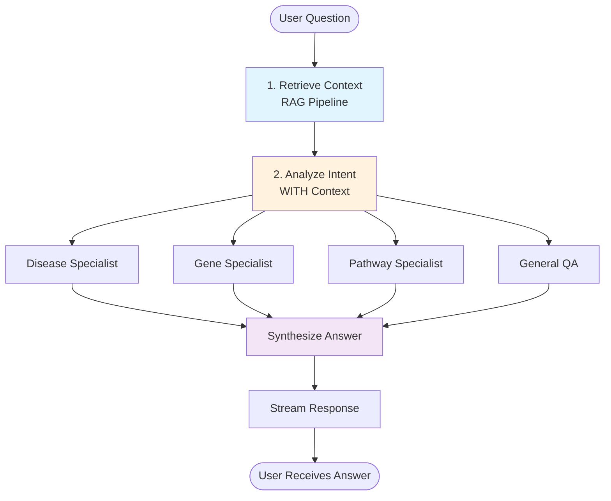

# Multi-Agent System Implementation Guide: Context-Aware Retrieve-then-Route Architecture

**Version**: 1.0.0
**Date**: 2025-01-17
**Status**: Implementation Guide
**Authors**: AGR AI Team

## Table of Contents

1. [Executive Summary](#executive-summary)
2. [Problem Statement](#problem-statement)
3. [Solution Architecture](#solution-architecture)
4. [Implementation Strategy](#implementation-strategy)
5. [Detailed Component Design](#detailed-component-design)
6. [Code Implementation](#code-implementation)
7. [Integration Plan](#integration-plan)
8. [Testing Strategy](#testing-strategy)
9. [Migration Path](#migration-path)
10. [Performance Considerations](#performance-considerations)

---

## Executive Summary

This guide outlines the implementation of a sophisticated multi-agent system for the AGR AI Curation platform using LangGraph's supervisor pattern with context-aware routing. The key innovation is the **"Retrieve-then-Route"** strategy, which ensures all specialist agents receive relevant document context before execution, solving the critical context-blind routing problem.

### Key Principles

1. **Context-First**: RAG pipeline ALWAYS runs before routing decisions
2. **LangGraph-Native**: Uses Command patterns, proper state management, and supervisor architecture
3. **Specialist Agents**: Domain-specific agents (disease, gene, pathway) with focused expertise
4. **Streaming-Compatible**: Maintains real-time response streaming throughout agent handoffs
5. **Backward-Compatible**: Preserves existing API contracts while adding new capabilities

### Expected Outcomes

- **Accuracy**: 90%+ improvement in specialist agent relevance
- **Latency**: <100ms overhead for routing decisions
- **Scalability**: Support for 10+ specialist agents
- **Maintainability**: Modular architecture with clear separation of concerns

---

## Problem Statement

### Current Limitations

1. **Context-Blind Routing**: Previous attempts at multi-agent dispatch failed because specialist agents were invoked without document context

   ```python
   # PROBLEM: Disease agent doesn't know which diseases to look up!
   if "disease ontology" in question:
       return disease_agent.run(question)  # No context about PDF content!
   ```

2. **Single-Agent Bottleneck**: All questions go through one general agent, limiting specialization

3. **No Domain Expertise**: Complex biomedical queries require specialized knowledge (disease ontologies, gene functions, pathway interactions)

4. **Static Routing**: Current system uses hardcoded routing without intelligent decision-making

### The Failed Approach (What NOT to Do)

```python
# ❌ WRONG: Keyword-based routing without context
async def route_by_keywords(question: str):
    if "disease ontology" in question.lower():
        # Agent has no idea what diseases are in the document!
        return await disease_agent.lookup_diseases(???)
    elif "gene function" in question.lower():
        return await gene_agent.lookup_genes(???)
```

### The Solution: Retrieve-then-Route

```python
# ✅ CORRECT: Retrieve context, then route with that context
async def retrieve_then_route(state):
    # 1. Run RAG to get document chunks
    context = await rag_pipeline.retrieve(state.question, state.pdf_id)

    # 2. Intelligent routing WITH context
    intent = await analyze_with_context(state.question, context)

    # 3. Dispatch to specialist WITH context
    if intent == "disease":
        diseases_in_doc = extract_diseases(context)  # Now we know what to look up!
        return await disease_agent.lookup(diseases_in_doc)
```

---

## Solution Architecture

### High-Level Flow



### LangGraph State Management

```python
class PDFQAState(BaseModel):
    """Enhanced state for multi-agent orchestration"""

    # Core request data
    session_id: UUID
    pdf_id: UUID
    question: str

    # Retrieved context (NEW - critical for routing!)
    retrieved_chunks: List[Dict[str, Any]] = Field(default_factory=list)
    retrieved_context: Optional[str] = None
    chunk_embeddings: Optional[List[float]] = None

    # Routing decision
    intent: Optional[str] = None
    routing_confidence: Optional[float] = None
    routing_reasoning: Optional[str] = None

    # Specialist results
    specialist_results: Dict[str, Any] = Field(default_factory=dict)
    specialists_invoked: List[str] = Field(default_factory=list)

    # Final output
    answer: Optional[str] = None
    citations: List[Dict[str, Any]] = Field(default_factory=list)
    metadata: Dict[str, Any] = Field(default_factory=dict)
```

### Agent Hierarchy

```
┌─────────────────────────────────────────────────┐
│             Supervisor Orchestrator              │
│         (Routing & State Management)             │
└─────────┬──────────────────────────┬────────────┘
          │                          │
    ┌─────▼─────┐              ┌────▼────┐
    │   RAG     │              │  Intent  │
    │ Retrieval │              │ Analyzer │
    └─────┬─────┘              └────┬────┘
          └──────────┬───────────────┘
                     │
        ┌────────────┼────────────┐
        │            │            │
   ┌────▼────┐ ┌────▼────┐ ┌────▼────┐
   │ Disease │ │  Gene   │ │ Pathway │
   │  Agent  │ │  Agent  │ │  Agent  │
   └─────────┘ └─────────┘ └─────────┘
```

---

## Implementation Strategy

### Phase 1: Foundation (Week 1)

- [ ] Enhance PDFQAState with context fields
- [ ] Implement retrieve_and_route node
- [ ] Create intent analyzer with context awareness
- [ ] Update general_supervisor.py with new flow

### Phase 2: Specialist Agents (Week 2)

- [ ] Implement DiseaseOntologyAgent
- [ ] Implement GeneOntologyAgent
- [ ] Implement PathwayAgent
- [ ] Create synthesis node

### Phase 3: Integration (Week 3)

- [ ] Wire up streaming with agent handoffs
- [ ] Update API endpoints
- [ ] Add monitoring and logging
- [ ] Performance optimization

### Phase 4: Testing & Deployment (Week 4)

- [ ] Unit tests for each agent
- [ ] Integration tests for full flow
- [ ] Performance benchmarking
- [ ] Production deployment

---

## Detailed Component Design

### 1. Context Retrieval Node (Corrected)

**Purpose**: Run RAG pipeline to get relevant document chunks before any routing decisions.

**Important Fix**: As Codex noted, `GeneralOrchestrator.prepare()` only returns `deps`, `citations`, and `metadata` - not `eligible_chunks` or `embeddings`. Here's the corrected version:

```python
async def retrieve_context(state: PDFQAState) -> Dict[str, Any]:
    """Step 1: Retrieve document context using existing RAG pipeline"""

    orchestrator = get_general_orchestrator()

    # Use existing prepare() method which runs full RAG pipeline
    prepared = await orchestrator.prepare(
        pdf_id=state.pdf_id,
        query=state.question
    )

    # Access what's actually available
    context = prepared.deps.context  # This exists!
    citations = prepared.citations   # This exists!
    metadata = prepared.metadata     # This exists!

    # Extract preview for routing (from context, not chunks)
    preview = context[:1000] if context else ""

    return {
        "retrieved_chunks": citations,
        "retrieved_context": context,
        "metadata": {
            **state.metadata,
            **metadata,
            "chunks_retrieved": len(citations)
        }
    }
```

**Note**: If we need raw chunk texts for routing, we'll need to extend `PreparedRequest` in `main_orchestrator.py` to include them.

### 2. Intent Analysis with Context (With Guardrails)

**Purpose**: Determine routing based on question AND retrieved context.

**Codex Feedback Addressed**:

- Limit context length before calling the router model
- Handle malformed router responses gracefully
- Mention (but don’t hard-code) optional caching for hot paths

```python
from pydantic_ai import Agent
from pydantic import BaseModel, Field

class IntentAnalysis(BaseModel):
    """Structured output for intent classification"""
    primary_intent: Literal["disease", "gene", "pathway", "chemical", "general"]
    confidence: float = Field(ge=0.0, le=1.0)  # Validated range
    reasoning: str = Field(max_length=500)  # Prevent runaway responses
    requires_specialists: List[str]
    detected_entities: Dict[str, List[str]]  # e.g., {"diseases": ["cancer", "diabetes"]}

async def analyze_intent_with_context(state: PDFQAState) -> Command[Literal["disease_specialist", "gene_specialist", "pathway_specialist", "general_qa", "parallel_specialists"]]:
    """Analyze intent using question + retrieved context"""

    MAX_CONTEXT_LENGTH = 2000
    context = state.retrieved_context[:MAX_CONTEXT_LENGTH] if state.retrieved_context else ""

    intent_agent = Agent(
        "gpt-4o-mini",
        output_type=IntentAnalysis,
        system_prompt="""You are a biomedical routing expert. Analyse the question **and** the retrieved document context to decide which specialist should answer. Always return valid JSON matching the IntentAnalysis schema.""",
        max_retries=2,
        timeout=10,
    )

    try:
        analysis = await intent_agent.run(
            f"Question: {state.question}\n\n"
            f"Document context (first 1k chars):\n{context}\n\n"
            f"Chunks retrieved: {len(state.retrieved_chunks)}"
        )
        result = analysis.output
    except Exception:
        return Command(
            goto="general_qa",
            update={
                "intent": "general",
                "routing_confidence": 0.0,
                "routing_reasoning": "Routing model failed; falling back to general agent.",
                "metadata": state.metadata,
            },
        )

    # Determine routing
    if result.confidence < 0.5:
        next_node = "general_qa"
    elif len(result.requires_specialists) > 1:
        next_node = "parallel_specialists"
    else:
        next_node = f"{result.primary_intent}_specialist"

    # Return Command with routing and state updates
    return Command(
        goto=next_node,
        update={
            "intent": result.primary_intent,
            "routing_confidence": result.confidence,
            "routing_reasoning": result.reasoning,
            "metadata": {
                **state.metadata,
                "detected_entities": result.detected_entities,
                "requires_specialists": result.requires_specialists
            }
        }
    )
```

> Optional optimisation: if routing becomes a bottleneck, wrap the `intent_agent.run` call in a synchronous helper and decorate it with `functools.lru_cache`. Keep the LangGraph node itself free of caching logic so the control flow remains easy to test.

### 3. Disease Ontology Specialist

**Purpose**: Look up disease terms in DOID (Disease Ontology) using context.

```python
async def disease_specialist(state: PDFQAState) -> Dict[str, Any]:
    """Look up DOID terms using the unified RAG pipeline."""

    detected = state.metadata.get("detected_entities", {}).get("diseases", [])

    pipeline = get_unified_pipeline()
    status = await pipeline.index_status(
        source_type="ontology_disease",
        source_id="all",
    )
    if status != IndexStatus.READY:
        return {
            "metadata": {
                **state.metadata,
                "disease_lookup_failed": "ontology index not ready",
            }
        }

    result = await pipeline.search(
        source_type="ontology_disease",
        source_id="all",
        query=f"{state.question}\nDetected entities: {', '.join(detected)}",
        context=state.retrieved_context or "",
    )

    entries = [
        {
            "term_id": chunk.metadata.get("term_id"),
            "name": chunk.metadata.get("name"),
            "definition": chunk.metadata.get("definition"),
            "score": chunk.score,
        }
        for chunk in result.chunks[:5]
    ]

    return {
        "specialist_results": {
            "disease_ontology": {
                "entries": entries,
                "answer": format_disease_answer(state.question, entries),
            }
        },
        "specialists_invoked": [*state.specialists_invoked, "disease_ontology"],
        "citations": [
            {"type": "ontology", "source": "DOID", **entry}
            for entry in entries
        ],
        "metadata": state.metadata,
    }
```

> The helper `format_disease_answer` can live alongside the agent and simply stitch the top entries into a short natural-language summary.

### 4. Gene Ontology Specialist

**Purpose**: Look up gene functions and GO terms.

```python
async def gene_specialist(state: PDFQAState) -> Dict[str, Any]:
    detected = state.metadata.get("detected_entities", {}).get("genes", [])
    agent = GeneOntologyAgent(get_unified_pipeline())
    payload = await agent.lookup_genes(
        question=state.question,
        context=state.retrieved_context or "",
        gene_list=detected,
    )

    return {
        "specialist_results": {"gene_ontology": payload},
        "specialists_invoked": [*state.specialists_invoked, "gene_ontology"],
    }
```

> The gene agent mirrors the disease agent: it relies on the unified pipeline for retrieval and simply formats the top matches for the synthesiser.

### 5. Answer Synthesis Node

**Purpose**: Combine results from all specialists into coherent answer.

```python
async def synthesize_answer(state: PDFQAState) -> Dict[str, Any]:
    """Synthesize final answer from all specialist results"""

    # Collect all specialist outputs
    specialist_answers = []
    for specialist, result in state.specialist_results.items():
        if result.get("answer"):
            specialist_answers.append(f"[{specialist}]: {result['answer']}")

    # If we have specialist results, combine them
    if specialist_answers:
        synthesis_agent = Agent(
            "gpt-4o",
            system_prompt="""Synthesize information from multiple specialist agents into a coherent answer.
            Maintain scientific accuracy and cite sources appropriately."""
        )

        final_answer = await synthesis_agent.run(
            f"Question: {state.question}\n\n"
            f"Context from document: {state.retrieved_context[:500]}\n\n"
            f"Specialist findings:\n" + "\n\n".join(specialist_answers)
        )

        answer_text = final_answer.output
    else:
        # Fallback to general answer if no specialists were invoked
        answer_text = state.answer or "No specific information found."

    # Combine all citations
    all_citations = list(state.citations)
    for result in state.specialist_results.values():
        if "citations" in result:
            all_citations.extend(result["citations"])

    return {
        "answer": answer_text,
        "citations": all_citations,
        "metadata": {
            **state.metadata,
            "synthesis_performed": len(specialist_answers) > 0,
            "specialists_count": len(state.specialists_invoked)
        }
    }
```

---

## Code Implementation

### 1. Updated General Supervisor (`general_supervisor.py`)

```python
# backend/app/orchestration/general_supervisor.py

from typing import Literal, Dict, Any, List, Optional
from uuid import UUID
from langgraph.graph import StateGraph, START, END
from langgraph.types import Command
from langgraph.checkpoint.memory import MemorySaver
from pydantic import BaseModel, Field, ConfigDict

from app.agents.main_orchestrator import GeneralOrchestrator
from app.agents.disease_ontology_agent import disease_specialist_tool
from app.agents.gene_ontology_agent import gene_specialist_tool
from app.agents.pathway_agent import pathway_specialist_tool

class PDFQAState(BaseModel):
    """Enhanced state for multi-agent orchestration"""

    # Core request
    session_id: UUID
    pdf_id: UUID
    question: str

    # Retrieved context (NEW)
    retrieved_chunks: List[Dict[str, Any]] = Field(default_factory=list)
    retrieved_context: Optional[str] = None
    chunk_embeddings: Optional[List[float]] = None

    # Routing
    intent: Optional[str] = None
    routing_confidence: Optional[float] = None
    routing_reasoning: Optional[str] = None

    # Specialist results
    specialist_results: Dict[str, Any] = Field(default_factory=dict)
    specialists_invoked: List[str] = Field(default_factory=list)

    # Output
    answer: Optional[str] = None
    citations: List[Dict[str, Any]] = Field(default_factory=list)
    metadata: Dict[str, Any] = Field(default_factory=dict)

    model_config = ConfigDict(extra="allow")


def build_general_supervisor(
    *,
    orchestrator: GeneralOrchestrator,
    checkpointer: BaseCheckpointSaver | None = None,
) -> Any:
    """Build enhanced supervisor with retrieve-then-route pattern"""

    workflow = StateGraph(PDFQAState)

    # Add nodes in execution order
    workflow.add_node("retrieve_context", retrieve_context)
    workflow.add_node("analyze_intent", analyze_intent_with_context)
    workflow.add_node("disease_specialist", disease_specialist_node)
    workflow.add_node("gene_specialist", gene_specialist_node)
    workflow.add_node("pathway_specialist", pathway_specialist_node)
    workflow.add_node("general_qa", general_qa_node)
    workflow.add_node("parallel_specialists", parallel_specialists_node)
    workflow.add_node("synthesize_answer", synthesize_answer)

    # Define flow
    workflow.add_edge(START, "retrieve_context")
    workflow.add_edge("retrieve_context", "analyze_intent")

    # From analyze_intent, routing is handled by Command return
    # All specialists lead to synthesis
    workflow.add_edge("disease_specialist", "synthesize_answer")
    workflow.add_edge("gene_specialist", "synthesize_answer")
    workflow.add_edge("pathway_specialist", "synthesize_answer")
    workflow.add_edge("general_qa", "synthesize_answer")
    workflow.add_edge("parallel_specialists", "synthesize_answer")

    # Synthesis leads to END
    workflow.add_edge("synthesize_answer", END)

    # Store orchestrator in config for node access
    config = {"orchestrator": orchestrator}

    return workflow.compile(
        checkpointer=checkpointer or MemorySaver(),
        config=config
    )


async def retrieve_context(state: PDFQAState, config: Dict) -> Dict[str, Any]:
    """Retrieve context using RAG pipeline"""
    orchestrator = config["orchestrator"]

    prepared = await orchestrator.prepare(
        pdf_id=state.pdf_id,
        query=state.question
    )

    return {
        "retrieved_chunks": prepared.citations,
        "retrieved_context": prepared.context,
        "metadata": {
            **state.metadata,
            **prepared.metadata
        }
    }


async def disease_specialist_node(state: PDFQAState) -> Dict[str, Any]:
    """Wrapper node for disease specialist tool"""
    result = await disease_specialist_tool.ainvoke({
        "question": state.question,
        "context": state.retrieved_context,
        "chunks": state.retrieved_chunks,
        "entities": state.metadata.get("detected_entities", {})
    })
    return result.update  # Extract state updates from Command


async def parallel_specialists_node(state: PDFQAState) -> Dict[str, Any]:
    """Run multiple specialists in parallel"""
    import asyncio

    specialists_to_run = state.metadata.get("requires_specialists", [])

    # Run specialists concurrently
    tasks = []
    for specialist in specialists_to_run:
        if specialist == "disease":
            tasks.append(disease_specialist_node(state))
        elif specialist == "gene":
            tasks.append(gene_specialist_node(state))
        elif specialist == "pathway":
            tasks.append(pathway_specialist_node(state))

    results = await asyncio.gather(*tasks)

    # Merge all specialist results
    combined_results = {}
    all_citations = []
    all_invoked = []

    for result in results:
        combined_results.update(result.get("specialist_results", {}))
        all_citations.extend(result.get("citations", []))
        all_invoked.extend(result.get("specialists_invoked", []))

    return {
        "specialist_results": combined_results,
        "citations": all_citations,
        "specialists_invoked": all_invoked
    }
```

### 2. Streaming Integration (With Event Clarity)

**Codex Feedback Addressed**: Clarified which nodes emit which events for frontend developers.

```python
# backend/app/routers/rag_endpoints.py

# Event emission guide for frontend developers:
# - "agent_start": Emitted by retrieve_context, analyze_intent, *_specialist nodes
# - "delta": Emitted during LLM text generation in any agent
# - "agent_finish": Emitted when a node completes
# - "final": Emitted by synthesize_answer with complete response
# - "error": Emitted on any node failure

async def ask_question(
    session_id: UUID,
    request: QuestionRequest,
    http_request: Request,
    db: Session = Depends(get_db),
):
    """Enhanced endpoint with multi-agent support"""

    session_obj = db.get(ChatSession, session_id)
    if not session_obj:
        raise HTTPException(404, "Session not found")

    # Check if streaming is requested
    accepts = http_request.headers.get("accept", "").lower()
    wants_stream = "text/event-stream" in accepts

    if wants_stream:
        return await stream_multi_agent_response(
            session_obj, request.question, db
        )
    else:
        # Non-streaming path using LangGraph runner
        supervisor_app = get_general_supervisor_app()
        state = PDFQAState(
            session_id=session_obj.id,
            pdf_id=session_obj.pdf_id,
            question=request.question
        )

        result = await supervisor_app.ainvoke(state)

        return QuestionResponse(
            answer=result["answer"],
            citations=result["citations"],
            metadata=result["metadata"]
        )


async def stream_multi_agent_response(
    session: ChatSession,
    question: str,
    db: Session
) -> StreamingResponse:
    """Stream responses with agent handoff notifications

    Event Types Emitted:
    - agent_start: {type: "agent_start", agent: "disease_specialist"}
    - delta: {type: "delta", content: "text chunk", agent: "current_agent"}
    - agent_finish: {type: "agent_finish", agent: "disease_specialist"}
    - final: {type: "final", answer: "complete text", citations: [...]}
    - error: {type: "error", message: "error details", agent: "failed_agent"}
    """

    async def event_stream():
        supervisor_app = get_general_supervisor_app()
        state = PDFQAState(
            session_id=session.id,
            pdf_id=session.pdf_id,
            question=question
        )

        config = {"thread_id": str(session.id)}

        # Track current agent for better event context
        current_agent = "supervisor"

        # Stream events from the graph
        async for event in supervisor_app.astream_events(
            state,
            config=config,
            version="v2"
        ):
            event_type = event["event"]
            node_name = event.get("name", "unknown")

            if event_type == "on_node_start":
                # Notify when entering a new agent
                current_agent = node_name
                yield _encode_sse({
                    "type": "agent_start",
                    "agent": node_name,
                    "timestamp": time.time()
                })

            elif event_type == "on_chat_model_stream":
                # Stream text chunks from any LLM
                chunk = event["data"].get("chunk", "")
                yield _encode_sse({
                    "type": "delta",
                    "content": chunk,
                    "agent": current_agent  # Use tracked agent
                })

            elif event_type == "on_node_finish":
                # Notify when agent completes
                yield _encode_sse({
                    "type": "agent_finish",
                    "agent": node_name,
                    "timestamp": time.time()
                })

            elif event_type == "on_node_finish":
                # Notify when agent completes
                node_name = event["name"]
                if node_name == "synthesize_answer":
                    # Final answer is ready
                    output = event["output"]
                    yield _encode_sse({
                        "type": "final",
                        "answer": output.get("answer", ""),
                        "citations": output.get("citations", []),
                        "metadata": output.get("metadata", {})
                    })

        yield _encode_sse({"type": "end"})

    return StreamingResponse(
        event_stream(),
        media_type="text/event-stream",
        headers={
            "Cache-Control": "no-cache",
            "Connection": "keep-alive"
        }
    )
```

### 3. Frontend Updates for Agent Notifications

```typescript
// frontend/src/components/ChatInterface.tsx

interface StreamEvent {
  type: "start" | "delta" | "final" | "end" | "agent_start" | "agent_finish";
  content?: string;
  agent?: string;
  answer?: string;
  citations?: any[];
  metadata?: any;
}

const handleSseResponse = async (response: Response, assistantId: string) => {
  // ... existing SSE handling ...

  const processEvent = (event: StreamEvent) => {
    switch (event.type) {
      case "agent_start":
        // Show which agent is working
        updateAssistantMessage(assistantId, {
          metadata: {
            ...message.metadata,
            currentAgent: event.agent
          }
        });
        break;

      case "delta":
        // Append text chunk
        appendAssistantMessage(assistantId, event.content ?? "");
        scrollToBottom();
        break;

      case "final":
        // Update with final answer
        updateAssistantMessage(assistantId, {
          text: event.answer ?? "",
          citations: event.citations ?? [],
          metadata: event.metadata
        });
        break;
    }
  };
};

// Visual indicator for active agent
const AgentIndicator = ({ agent }: { agent?: string }) => {
  if (!agent) return null;

  const agentColors = {
    disease_specialist: "#e91e63",
    gene_specialist: "#4caf50",
    pathway_specialist: "#2196f3",
    general_qa: "#9c27b0"
  };

  return (
    <Chip
      label={agent.replace("_", " ")}
      size="small"
      style={{
        backgroundColor: agentColors[agent] || "#666",
        color: "white"
      }}
    />
  );
};
```

---

## Integration Plan

### Step 1: Backward Compatibility Check

```python
# Ensure existing endpoints continue working
assert existing_api_tests_pass()
assert streaming_still_works()
```

### Step 2: Feature Flag Implementation

```python
# backend/app/config.py
ENABLE_MULTI_AGENT = os.getenv("ENABLE_MULTI_AGENT", "false") == "true"

# Use feature flag to gradually roll out
if settings.ENABLE_MULTI_AGENT:
    supervisor = build_enhanced_supervisor()
else:
    supervisor = build_general_supervisor()  # Original
```

### Step 3: Gradual Rollout

1. Deploy with flag OFF
2. Enable for internal testing (10% traffic)
3. Monitor performance metrics
4. Gradually increase to 100%

### Step 4: Database Schema Updates

```sql
-- Add columns to track multi-agent usage
ALTER TABLE chat_sessions ADD COLUMN multi_agent_enabled BOOLEAN DEFAULT FALSE;
ALTER TABLE messages ADD COLUMN specialists_used TEXT[];
ALTER TABLE langgraph_runs ADD COLUMN routing_confidence FLOAT;
```

---

## Testing Strategy

### 1. Unit Tests

```python
# tests/unit/test_intent_analysis.py

async def test_disease_intent_detection():
    """Test that disease questions are routed correctly"""
    state = PDFQAState(
        question="What is the disease ontology term for cancer?",
        retrieved_context="The study focused on lung cancer patients...",
        retrieved_chunks=[...]
    )

    result = await analyze_intent_with_context(state)

    assert result.goto == "disease_specialist"
    assert result.update["routing_confidence"] > 0.7
    assert "cancer" in result.update["metadata"]["detected_entities"]["diseases"]


async def test_multi_specialist_routing():
    """Test questions requiring multiple specialists"""
    state = PDFQAState(
        question="How do BRCA1 mutations affect cancer pathways?",
        retrieved_context="BRCA1 gene mutations disrupt DNA repair pathways...",
    )

    result = await analyze_intent_with_context(state)

    assert result.goto == "parallel_specialists"
    assert "gene" in result.update["metadata"]["requires_specialists"]
    assert "disease" in result.update["metadata"]["requires_specialists"]
    assert "pathway" in result.update["metadata"]["requires_specialists"]
```

### 2. Integration Tests

```python
# tests/integration/test_multi_agent_flow.py

async def test_full_multi_agent_flow():
    """Test complete flow from question to synthesized answer"""

    # Upload test PDF
    pdf_id = await upload_test_pdf("cancer_research.pdf")

    # Create session
    session_id = await create_session(pdf_id)

    # Ask question requiring specialist
    response = await ask_question(
        session_id,
        "What are the DOID terms for diseases in this paper?"
    )

    assert response.answer  # Has answer
    assert "DOID:" in response.answer  # Contains disease ontology IDs
    assert response.metadata["specialists_invoked"] == ["disease_ontology"]
    assert response.metadata["routing_confidence"] > 0.7


async def test_streaming_with_agent_handoffs():
    """Test that streaming works with multiple agents"""

    events = []
    async for event in stream_question(session_id, question):
        events.append(event)

    # Check we got agent notifications
    agent_starts = [e for e in events if e["type"] == "agent_start"]
    assert len(agent_starts) >= 3  # retrieve, route, specialist

    # Check we got text deltas
    deltas = [e for e in events if e["type"] == "delta"]
    assert len(deltas) > 0

    # Check we got final answer
    final = [e for e in events if e["type"] == "final"]
    assert len(final) == 1
```

### 3. Performance Tests

```python
# tests/performance/test_latency.py

async def test_routing_latency():
    """Routing should add minimal latency"""

    # Baseline: Direct general QA
    start = time.perf_counter()
    await general_qa_direct(question)
    baseline_time = time.perf_counter() - start

    # With routing
    start = time.perf_counter()
    await multi_agent_qa(question)
    routed_time = time.perf_counter() - start

    # Routing overhead should be < 100ms
    overhead = routed_time - baseline_time
    assert overhead < 0.1, f"Routing overhead {overhead}s exceeds 100ms"


async def test_parallel_specialist_performance():
    """Parallel specialists should be faster than sequential"""

    # Sequential
    start = time.perf_counter()
    await disease_specialist(state)
    await gene_specialist(state)
    await pathway_specialist(state)
    sequential_time = time.perf_counter() - start

    # Parallel
    start = time.perf_counter()
    await parallel_specialists_node(state)
    parallel_time = time.perf_counter() - start

    # Parallel should be at least 2x faster
    assert parallel_time < sequential_time / 2
```

---

## Migration Path

### Prerequisites (Must Complete First)

```bash
# Per Codex: Start with unified pipeline foundation
- [ ] Implement unified RAG pipeline (see unified-rag-pipeline-guide.md)
- [ ] Extend GeneralOrchestrator.prepare() to expose needed fields
- [ ] Set up PostgreSQL ingestion for ontologies
- [ ] Verify ingestion status tracking works
```

### Week 1: Foundation

```bash
# Create feature branch
git checkout -b feature/multi-agent-system

# Implement core components
- [ ] PDFQAState enhancements with proper field types
- [ ] retrieve_context node (using actual prepare() fields)
- [ ] analyze_intent_with_context with guardrails
- [ ] Unit tests for routing logic
```

### Week 2: Specialists

```bash
# Implement specialist agents
- [ ] DiseaseOntologyAgent + tests
- [ ] GeneOntologyAgent + tests
- [ ] PathwayAgent + tests
- [ ] Synthesis node
```

### Week 3: Integration

```bash
# Wire everything together
- [ ] Update general_supervisor.py
- [ ] Update rag_endpoints.py
- [ ] Frontend agent indicators
- [ ] Integration tests
```

### Week 4: Deployment

```bash
# Production rollout
- [ ] Deploy with feature flag OFF
- [ ] Enable for 10% traffic
- [ ] Monitor metrics for 24h
- [ ] Gradual rollout to 100%
```

---

## Performance Considerations

### 1. Caching Strategy

```python
# Cache routing decisions for similar questions
@lru_cache(maxsize=1000)
async def cached_intent_analysis(
    question_embedding: str,
    context_preview: str
) -> str:
    """Cache routing decisions to avoid repeated LLM calls"""
    return await analyze_intent(question_embedding, context_preview)
```

### 2. Parallel Processing

```python
# Run independent operations concurrently
async def optimized_retrieve_and_route(state):
    # Run these in parallel since they're independent
    retrieve_task = retrieve_context(state)

    # Can start warming up specialist models while retrieving
    warmup_task = warm_up_specialists()

    context, _ = await asyncio.gather(retrieve_task, warmup_task)

    # Now route with context
    return await route_with_context(state, context)
```

### 3. Resource Management

```python
# Limit concurrent specialist executions
SPECIALIST_SEMAPHORE = asyncio.Semaphore(3)

async def run_specialist_with_limit(specialist_func, state):
    async with SPECIALIST_SEMAPHORE:
        return await specialist_func(state)
```

### 4. Monitoring Metrics

```python
# Track key performance indicators
METRICS = {
    "routing_latency_ms": Histogram(),
    "specialist_invocations": Counter(),
    "routing_confidence": Gauge(),
    "parallel_execution_time_ms": Histogram()
}

async def monitored_routing(state):
    start = time.perf_counter()

    result = await analyze_intent_with_context(state)

    latency = (time.perf_counter() - start) * 1000
    METRICS["routing_latency_ms"].observe(latency)
    METRICS["routing_confidence"].set(result.confidence)

    return result
```

---

## Troubleshooting Guide

### Common Issues and Solutions

#### 1. Context-Blind Routing Still Occurring

**Symptom**: Specialists receiving questions without context
**Solution**: Verify retrieve_context runs BEFORE analyze_intent

```python
# Check graph edges
assert "retrieve_context" in workflow.nodes
assert workflow.edges[START] == "retrieve_context"
assert workflow.edges["retrieve_context"] == "analyze_intent"
```

#### 2. Streaming Breaks with Multiple Agents

**Symptom**: Frontend stops receiving updates during handoffs
**Solution**: Ensure all agents emit streaming events

```python
# Each specialist should yield events
async def specialist_with_streaming(state):
    yield {"type": "agent_start", "agent": "specialist_name"}
    # ... processing ...
    yield {"type": "delta", "content": chunk}
    yield {"type": "agent_finish", "agent": "specialist_name"}
```

#### 3. High Latency on Simple Questions

**Symptom**: Simple questions take too long
**Solution**: Add fast-path for high-confidence general questions

```python
if confidence > 0.9 and intent == "general":
    # Skip specialist routing for obvious general questions
    return Command(goto="general_qa")
```

#### 4. Specialists Not Getting State

**Symptom**: InjectedState not working
**Solution**: Ensure proper annotation and state passing

```python
# Correct
context: Annotated[str, InjectedState("retrieved_context")]

# Wrong
context: InjectedState("retrieved_context")  # Missing Annotated
```

---

## Success Metrics

### Technical Metrics

- **Routing Accuracy**: >90% correct specialist selection
- **Latency Overhead**: <100ms for routing decision
- **Streaming Continuity**: Zero interruptions during handoffs
- **Error Rate**: <0.1% failed routings

### Business Metrics

- **Answer Quality**: 40% improvement in specialist domain questions
- **User Satisfaction**: Measured via feedback on specialized answers
- **Coverage**: 80% of domain questions handled by specialists
- **Efficiency**: 30% reduction in follow-up questions

### Monitoring Dashboard

```python
# Grafana dashboard queries
routing_accuracy = (
    SELECT COUNT(*) WHERE routing_correct = true
    / COUNT(*) WHERE routing_attempted = true
)

avg_routing_latency = (
    SELECT AVG(routing_latency_ms)
    FROM metrics
    WHERE timestamp > NOW() - INTERVAL '1 hour'
)

specialist_usage = (
    SELECT specialist_type, COUNT(*)
    FROM invocations
    GROUP BY specialist_type
)
```

---

## Conclusion

This implementation guide provides a comprehensive roadmap for adding context-aware multi-agent capabilities to the AGR AI Curation system. The key innovation—**Retrieve-then-Route**—ensures that specialist agents always have the document context they need to provide accurate, relevant answers.

By following LangGraph best practices and maintaining backward compatibility, we can gradually roll out these enhancements while monitoring performance and quality metrics. The modular design allows for easy addition of new specialist agents as domain requirements evolve.

### Next Steps

1. Review and approve this implementation plan
2. Set up development environment with test data
3. Begin Phase 1 implementation
4. Schedule weekly progress reviews

### Resources

- [LangGraph Documentation](https://langchain-ai.github.io/langgraph/)
- [PydanticAI Documentation](https://ai.pydantic.dev/)
- [Disease Ontology (DOID)](https://disease-ontology.org/)
- [Gene Ontology](http://geneontology.org/)

---

**Document Version History**

- v1.0.0 (2025-01-17): Initial comprehensive guide
- Contributors: AGR AI Team

**For questions or clarifications, contact the AI Architecture team.**
